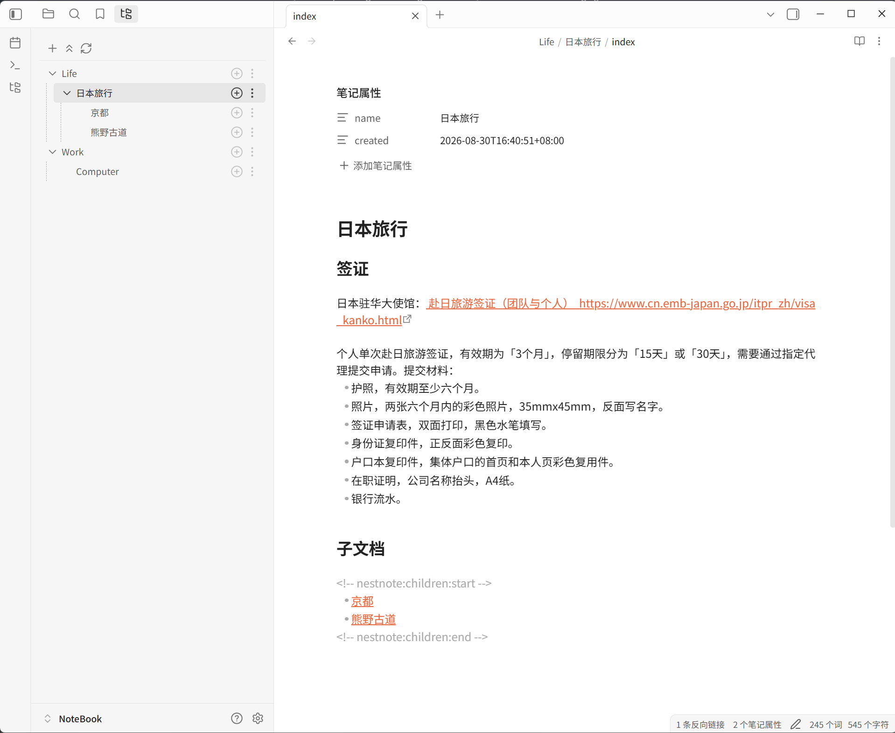
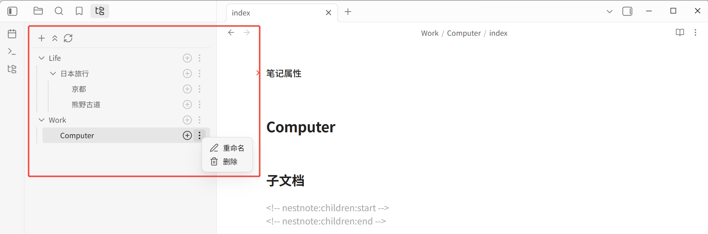
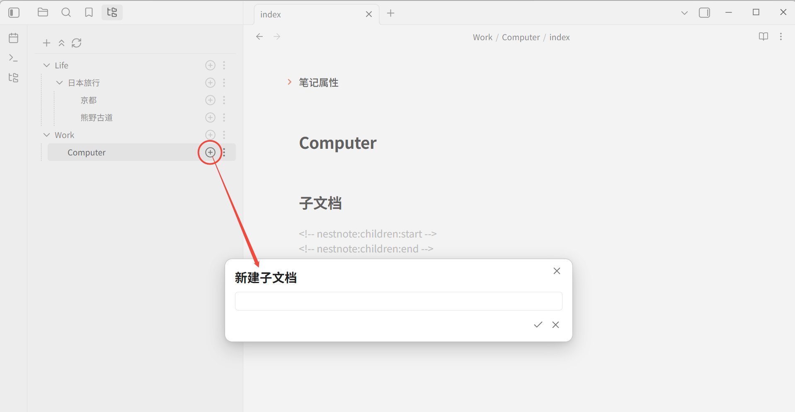
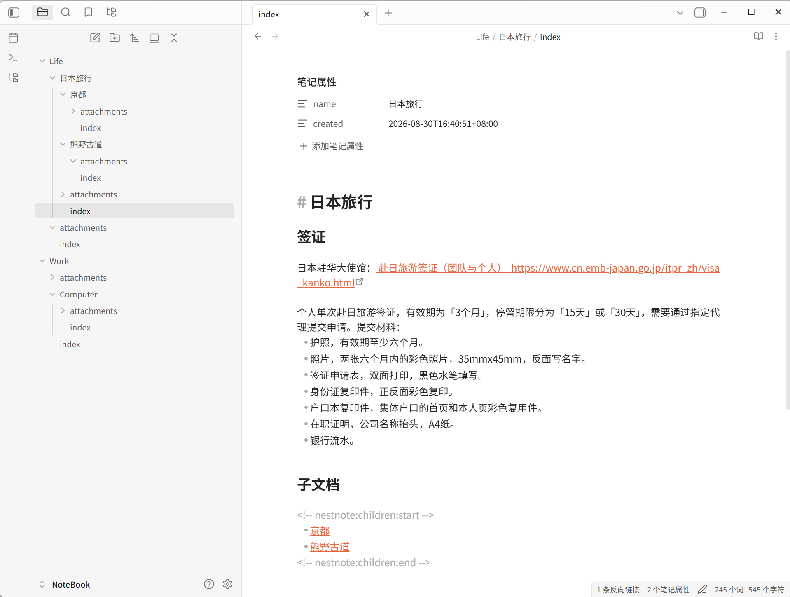

# NestNote

[English](README.md) | [中文](README_zh.md)

NestNote 是一个 [Obsidian](https://obsidian.md/) 插件，把 **文件夹当作文档**。每个文档是一个同时包含 `index.md` 和 `attachments/` 的目录；根文档为第 0 级，默认可再嵌套 5 层子文档（可在 `0～9` 间调整）。插件用自己的侧边栏展示和操作这棵文档树，只读写库里的文件，不另建索引数据库。

- **显示名称：** NestNote
- **插件 ID：** `nest-note`
- **最低 Obsidian 版本：** 1.7.2
- **许可证：** [GPL-3.0](LICENSE)
- **界面语言：** 跟随 Obsidian 应用语言。简体中文和繁体中文目前都显示简体中文（暂无独立繁体文案），其他语言显示英文。

## 安装

在 Obsidian **设置 → 社区插件** 中搜索 **NestNote**，安装并启用即可。



不想走社区插件、或要装开发版时，见文末「从源码构建」。

## 使用说明

### 打开面板

点最左侧功能区的 NestNote 图标，或在命令面板运行 **NestNote: 打开文档树**。

也可在 **设置 → 快捷键** 里为下面的命令绑定按键。

### 创建第一篇文档

库里还没有 NestNote 文档时，用侧边栏工具栏的 **新建根文档**（或命令 **NestNote: 新建根文档**）。它始终在库的根目录创建，与侧边栏里点了哪一行无关。在名称对话框里输入合法的名称，按 **Enter** 或点确认即可创建。

创建成功后打开该文档的 `index.md`，并在侧边栏选中（需要时展开祖先）。在文档里点击子文档链接打开另一篇 NestNote 文档，或启动时恢复上次正在浏览的文档时，侧边栏同样会展开并选中对应节点。

已有的普通 Markdown 笔记不会自动变成 NestNote 文档，插件也不会补全缺少 `index.md` 或 `attachments/` 的目录。需要的话请用插件新建，或按下一节的约定自行建好目录后再刷新。

### 侧边栏


| 操作          | 方式                                                                    |
| ----------- | --------------------------------------------------------------------- |
| 打开文档        | 点击侧边栏中的文档名称                                                           |
| 新建子文档       | 某一行上的按钮，建在该文档下面                                                       |
| 调整嵌套与顺序 | 拖到另一份文档上成为其子文档；拖到树的空白处成为根文档。拖到同级文档的上方或下方可排序。根文档仍按名称排序 |
| 重命名         | 该行「更多」→ 重命名                                                           |
| 展开 / 折叠全部子文档 | 该行「更多」→ **全部展开** 或 **全部折叠**。只作用于该文档下的整棵子树；没有子文档时不显示此项 |
| 删除          | 该行「更多」→ 删除；**每次删除都会先确认**                                              |
| 全部展开 / 全部折叠 | 工具栏按钮。只要还有未展开的节点，就显示「全部展开」；全部展开后变为「全部折叠」。没有可展开节点时按钮不可用。只改展开状态，不重新扫描文件 |
| 刷新          | 工具栏按钮，或命令 **NestNote: 刷新**。库里文件变化后也会自动刷新整棵树                           |




点某一行上的加号可新建子文档：



命令 **NestNote: 新建子文档** 和行内按钮不同：它看的是当前正在编辑的文件，**必须先打开父文档的** `index.md`，不会用侧边栏里选中的那一行。

### 设置

在 Obsidian **设置 → NestNote** 中：


| 设置项               | 说明                                                                  |
| ----------------- | ------------------------------------------------------------------- |
| 最大子文档层级           | 范围 `0～9`，默认 `5`。根文档为第 `0` 级。超出限制的目录不出现在侧边栏里，也不能再往下创建。设为 `0` 时只显示根文档 |
| 启动时打开 NestNote 面板 | 默认开启。只影响下次启动，不会关掉当前已经打开的面板                                          |
| 自动修正文档格式 | 默认开启。扫描时补全缺失的头部字段和子文档标记，并把子文档列表写成规范格式。关闭后，只有新建、删除、重命名、移动子文档时才会更新父文档链接 |


### 删除

- 无论有没有子文档，删除前都会确认。
- 确认后，**整个文档目录**（`index.md`、附件、以及下面所有子文档）会进入回收站。
- 实际去向跟随 Obsidian 自己的删除偏好：系统回收站，或库内的 `.trash/`。
- 从回收站还原后，插件会在察觉到库变化后重新识别并显示。
- 删除失败时侧边栏保持原状，并弹出错误提示。

### 命令

命令面板里的名称（前面会带 `NestNote:`）：


| 命令     | 作用                             |
| ------ | ------------------------------ |
| 打开文档树  | 打开 NestNote 面板                 |
| 新建根文档  | 在库根创建文档，然后打开其 `index.md` |
| 新建子文档  | 在当前打开的文档下创建子文档，然后打开其 `index.md` |
| 刷新     | 重新扫描并刷新侧边栏                     |
| 归档当前附件 | 把当前打开的附件移到所属文档的 `attachments/` |


## 文档是什么

一个 **完整文档** 必须同时满足：

1. 目录里有 `index.md`
2. 目录里有 `attachments/` 子目录
3. 目录名就是文档名

名为 `attachments` 的目录是保留名，不会被当成子文档。

### 示例

```text
库根/
├── Work/                          ← 根文档（第 0 级）
│   ├── index.md
│   ├── attachments/
│   ├── 项目 A/                    ← 第 1 级子文档
│   │   ├── index.md
│   │   ├── attachments/
│   │   └── 里程碑 1/              ← 第 2 级子文档
│   │       ├── index.md
│   │       └── attachments/
│   └── 项目 B/
│       ├── index.md
│       └── attachments/
├── 笔记 草稿/                     ← 名称可以含空格和中文
│   ├── index.md
│   └── attachments/
└── random-note.md                 ← 普通 Markdown，侧边栏不显示
```



### 不会出现在侧边栏里的内容


| 类型                    | 示例                          | 原因       |
| --------------------- | --------------------------- | -------- |
| 普通 Markdown 文件        | `notes/ideas.md`            | 不是完整文档目录 |
| 缺少 `index.md` 的目录     | `draft/`（只有 `attachments/`） | 不完整      |
| 缺少 `attachments/` 的目录 | `draft/`（只有 `index.md`）     | 不完整      |
| 名为 `attachments` 的目录  | `Work/attachments/`         | 保留名      |


### 文档头部信息

新建时（根文档和子文档相同），`index.md` 会写成下面这样。时间为创建当时，日期只是格式示例；界面为英文时，二级标题是 `Child Document`。

```markdown
---
name: Work
created: 2026-08-28T19:00:00+08:00
---
# Work


## 子文档

<!-- nestnote:children:start -->


<!-- nestnote:children:end -->
```


| 字段        | 说明                    |
| --------- | --------------------- |
| `name`    | 默认等于目录名；你在侧边栏重命名后会跟着改 |
| `created` | 首次创建时写入，之后不再改         |


文档名以 **目录名** 为准。缺少这段头部时，插件会在正文前补上，**不改你原来的正文**。头部格式损坏时也不会覆盖正文，只提示元数据异常。已有文档不会自动补上一级标题和「子文档」小标题。

### 子文档链接

父文档的 `index.md` 里有一段由插件维护的列表，新建时放在「子文档」标题下面：

```markdown
## 子文档

<!-- nestnote:children:start -->

- [项目 A](项目%20A/index.md)
- [项目 B](项目%20B/index.md)

<!-- nestnote:children:end -->

这里是你自己写的正文，插件不会改这段标记以外的内容。
```

新建、删除、重命名或移动子文档时，只更新这两行标记之间的列表。顺序与侧边栏一致：自定义顺序写在标记区内，新建接到末尾；扫描和自动修正会保留该顺序，只补缺失、删失效链接，并写成规范空行。列表与两个标记之间各空一行；即使没有空行，也不影响解析。链接是普通的相对路径，名称里的空格会写成 `%20`。你在正文里手写的链接不会被扫描、删除或改写。若开启「自动修正文档格式」（默认开启），扫描时也会把这段区域写成规范格式；找不到标记时插在头部后面。关闭该选项后，扫描不再改已有文件。

### 附件

继续用 Obsidian 原来的粘贴、插入和拖拽即可，不必找插件里的「插入附件」命令（插件也没有这条命令）。

正在编辑某个完整文档的 `index.md` 时，新产生的图片、PDF、音视频等，只要还不在该文档的 `attachments/` 里，一般会自动移进去。文件名冲突时会改成可用名称（例如 `image 1.png`）。

**不会移动：** 已经在别的完整文档目录或其 `attachments/` 里的文件，以及无法判断属于哪篇文档的位置（例如库根下的 `Inbox/`）。自动归档失败时不会反复弹提示；需要时可用 **NestNote: 归档当前附件** 手动移入。这条命令按附件所在路径向上查找所属文档，找不到或不能安全移动时会提示，并留在原处。

## 已知限制

- 不会把普通笔记或残缺目录自动改成完整文档。
- 超出「最大子文档层级」的目录仍留在库里，只是侧边栏不显示，也不能再通过插件往下建。
- 库文件一有变化，会重新扫描整个库再画树，目前不会只刷新被改到的那一支。库很大时刷新可能更明显。
- 自动归档附件只在能明确对应到当前这篇 `index.md` 时才会发生。

## 开发说明

面向要改代码、本地安装或发版的人。插件用户可以忽略本章。

### 从源码构建

需要 Node.js。Windows 请在 Git Bash 或 WSL 中执行（PowerShell 不能直接跑 `./build.sh`）。

```bash
git clone https://github.com/exbob/obsidian-nest-note.git
cd obsidian-nest-note
npm install
./build.sh
```

成功后把 `nest-note/` 复制到库的 `.obsidian/plugins/nest-note/`。该目录含 `main.js`、`manifest.json`、`styles.css`。再在 **设置 → 社区插件** 中启用 **NestNote**。

`./build.sh clean` 只删除 `main.js`、`main.js.map`（若存在）和 `./nest-note/`，不构建。`./build.sh` 与 `bash build.sh` 相同。

### 开发与检查

```bash
npm run dev       # 监听源码并重新构建
npm test          # 单元 / 集成测试
npx tsc --noEmit  # 类型检查
npm run build     # 生产构建（只生成仓库根目录的 main.js）
./build.sh        # 生产构建并写入 nest-note/
```

命令在代码里注册的 ID 为 `nestnote:open-document-tree` 等。Obsidian 可能会再加上插件前缀（例如 `nest-note:nestnote:open-document-tree`），以命令面板实际显示为准。

### 发布新版本

本插件已在社区插件目录中。后续发版：更新 `manifest.json` 的 `version`、推送代码，并用 `nest-note/` 里的 `main.js`、`manifest.json`、`styles.css` 创建 GitHub Release。Release 标签必须与版本号完全一致（例如 `1.0.1`，不要加 `v`）。不必再次提交社区目录。详见 [Obsidian 插件发布文档](https://docs.obsidian.md/plugins/releasing/submit-plugin)。

### 项目结构

```text
build.sh                             # 生产构建并写入 nest-note/；clean 只清产物
esbuild.config.mjs                   # 打包配置
manifest.json                        # 插件清单
styles.css                           # 侧边栏与对话框样式
nest-note/                           # 可复制到库的安装目录
src/
├── main.ts                          # 入口、命令、模块装配
├── types.ts                         # 共享类型
├── settings.ts                      # 设置模型与规范化
├── i18n/                            # 中英文案与 t()
├── domain/
│   ├── document-scanner.ts          # 完整文档识别与树构建
│   ├── frontmatter.ts               # 头部信息读写
│   └── children-links.ts            # 子文档链接
├── services/
│   ├── document-service.ts          # 创建、重命名、删除、打开
│   ├── attachment-service.ts        # 附件监听与归档
│   └── vault-event-coordinator.ts   # 库事件合并与刷新
└── ui/
    ├── document-tree-view.ts        # 侧边栏
    └── settings-tab.ts              # 设置页
tests/                               # Vitest
docs/superpowers/specs/              # 设计说明
```
